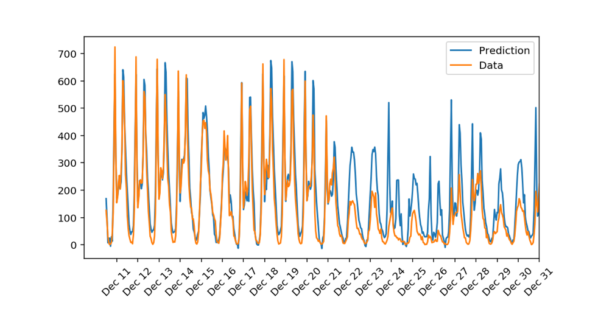

# P1: Predicting Bike Share Users

> In this project, a neural network is built and trained from scratch to predict the number of bike share users on a given day.

## About
A neural network is built to predict the number of bike sharing rides. Considering data from a bike-sharing company (like [CycleHop](http://cyclehop.com/)), a neural network is developed to predict from historical data, the number of bikes needed in the future.

## Files
- `data/*` – Dataset used. The data comes from the [UCI Machine Learning Database](https://archive.ics.uci.edu/ml/datasets/Bike+Sharing+Dataset).

- `Predicting_Bike_Share_Users.ipynb` – Project notebook.

- `Predicting_Bike_Share_Users.html` – HTML Export of the project notebook.

- `my_answers.py` – Contains the neural network implementation.

- `requirements.txt` – List of dependencies.

## License
[Modified MIT License © Pranav Suri](/License.txt)
