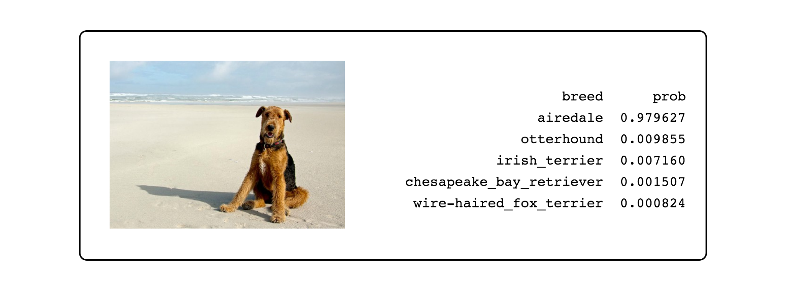

# P1: Dog Breed Classifier

> In this project, a dog breed recognition algorithm is built using Transfer Learning and Convolutional Neural Networks.

## About
A pipeline is built to process real-world, user-supplied images. Given an image of a dog, the developed algorithm provides an estimate of the canine's breed. If supplied with an image of a human, the code identifies the resembling dog breed.

## Files
The original repository of this project is https://github.com/udacity/dog-project.

- `dog_app.ipynb` – Project notebook.

- `dog_app.html` – HTML Export of the project notebook.

- `haarcascades/haarcascade_frontalface_alt.xml` – An OpenCV implementation of [Haar feature-based cascade classifiers](http://docs.opencv.org/trunk/d7/d8b/tutorial_py_face_detection.html) for detecting human faces ([source](https://github.com/opencv/opencv/tree/master/data/haarcascades)).

- `extract_bottleneck_features.py` – Functions to extract the bottleneck features.

##### Data
- The training data for this project is available [here](https://s3-us-west-1.amazonaws.com/udacity-aind/dog-project/dogImages.zip). This dataset contains 133 different breeds of dogs and is already split into train, test, and validation sets.

- Human images can be downloaded from [this link](http://vis-www.cs.umass.edu/lfw/lfw.tgz).

## License
[Modified MIT License © Pranav Suri](/License.txt)

Please note that for this project, [@cgearhart](https://github.com/cgearhart), [@luisguiserrano](https://github.com/luisguiserrano) are the default owners.
