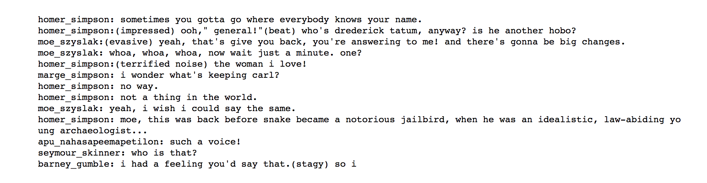

# P3: Generate TV Scripts

> This project generates TV scripts using a Recurrent Neural Network.

## About
In this project, a new TV script for a scene at Moe's Tavern (Simpsons) are generated using RNNs. The dataset used for training is a part of the Simpsons dataset of scripts from 27 seasons.

## Files
- `tv_script_generation.ipynb` – Project notebook.

- `tv_script_generation.html` – HTML Export of the project notebook.

- `helper.py` – Helper functions.

- `problem_unittests.py` – Unit tests.

- `requirements.txt` – List of dependencies.

## License
[Modified MIT License © Pranav Suri](/License.txt)
