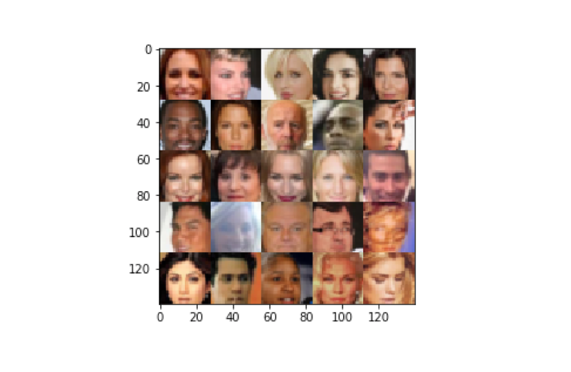

# P4: Generate Faces

> A Generative Adversarial Network is trained to generate realistic human faces from celebrity images.

## About
In this project, a Generative Adversarial Network is first used to generate new characters using the MNIST dataset. Then, on photographs of celebrities, a fresh network is trained to generate new faces.

## Files
- `face_generation.ipynb` – Project notebook.

- `face_generation.html` – HTML Export of the project notebook.

- `helper.py` – Helper functions.

- `problem_unittests.py` – Unit tests.

## License
[Modified MIT License © Pranav Suri](/License.txt)
